# Regression Analysis (Trip Duration)

For detailed analysis : `Trip_Duration_Regression_Analysis.ipynb`

---
## I. Problem Context
Automatidata works with its clients to transform their unused and stored data into useful solutions, such as performance dashboards, customer-facing tools, strategic business insights, and more. They specialize in identifying a client’s business needs and utilizing their data to meet those business needs.

The data consulting firm Automatidata's newest client, the NYC Taxi and Limousine Commission (New York City TLC) is an agency responsible for licensing and regulating New York City's taxi cabs and for-hire vehicles. The client wants the Automatidata team to discover the relationship between variety of variables and ride durations to help understand its pricing and fleet viability.

## II. Data Introduction
This project uses a dataset called "2017_Yellow_Taxi_Trip_Data.csv". It contains data gathered by the New York City Taxi & Limousine Commission. For each trip, there are many different data variables gathered. 

The dataset contains 408,294 rows – each row represents a different trip
For data feature explaination, please access `Data/Data_documentation.xlsx`

## III. PACE Workflow for Analysis
PLAN : conceptualize the scope of the project and develop the steps to guide through the process of completing the project
  - What is the main goal of this project?
    
    *Perform regression analysis to determine what affects ride durations based on a variety of variables*
  - What is the project scope?
    
    + *Determine what variables and how they affect trip duration*
    + *Perform model in a Python notebook*
    + *Draft an executive summary of results*

  - Who are the stakeholders for this project?
    - *Data and Analytics Department: This department within the New York City TLC will likely be working closely with the Automatidata team to provide data and insights on the variables that need to be analyzed.*

    - *Pricing Department: This department within the New York City TLC will be interested in the insights generated by Automatidata, as they may impact the pricing of taxi and limousine services in New York City.*

    - *Operations Department: The operations department within the New York City TLC may be interested in the findings and recommendations from Automatidata, as they may impact the operations of the taxi and limousine industry in New York City.*

    - *IT Department: The IT department within the New York City TLC will be responsible for ensuring that the data needed for the analysis is accessible and that any tools or dashboards created by Automatidata are properly integrated into their systems.*

    - *Finance Department: The finance department within the New York City TLC may be interested in the insights generated by Automatidata, as they may impact the financial viability of the taxi and limousine industry in New York City.*
  - How could I break the problem into subtasks?
    
    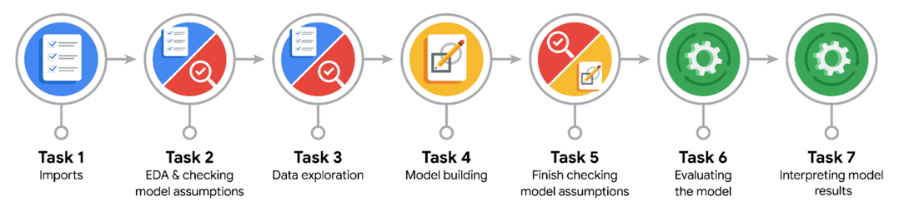

ANALYZE: collect, prepare, and analyze all of the data
  - Exploratory Data Analysis
  - Data cleaning
  - Feature engineering
  - Data validation

CONSTRUCT: build models to meet the project goal
  - Varaible selection
  - Select model approach
  - Build model
  - Assumption checking
  - Evaluating model

EXECUTE: present the finding of the analysis
  - Result summary
  - Present findings
  - Address feedback
## IV. Analysis Results
### 1. Checking for Linearity assumption

identify correlation between independent variables and dependent vairiable

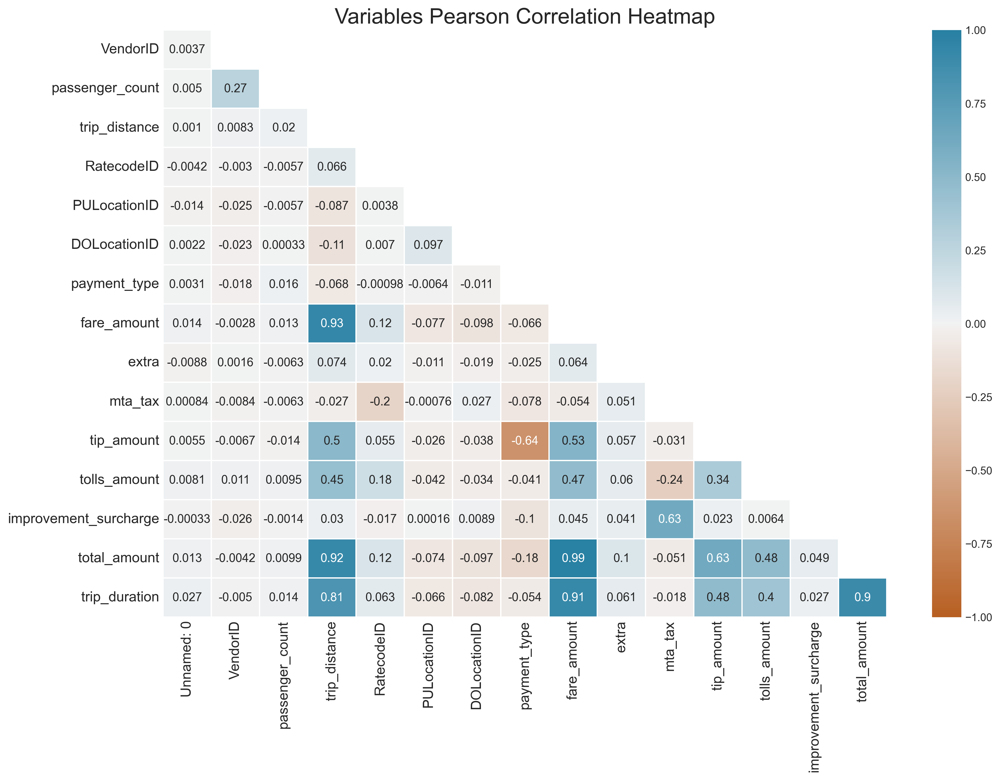

Based on the correlation matrix, independent continuous variables meet the linearity assumption (correlation with trip duration >= 0.4) are:

- `total_amount` (highest correlation score: 0.9)
- `trip_distance`
- `fare_amount`
- `tip_amount`
- `tolls_amount`

For categorical variables, I create violin plot to spot each group distribution based on `trip_duration`. In addtion to more clarify, I perform aggregrating average value of ride duration based on groups in each categorycal features:

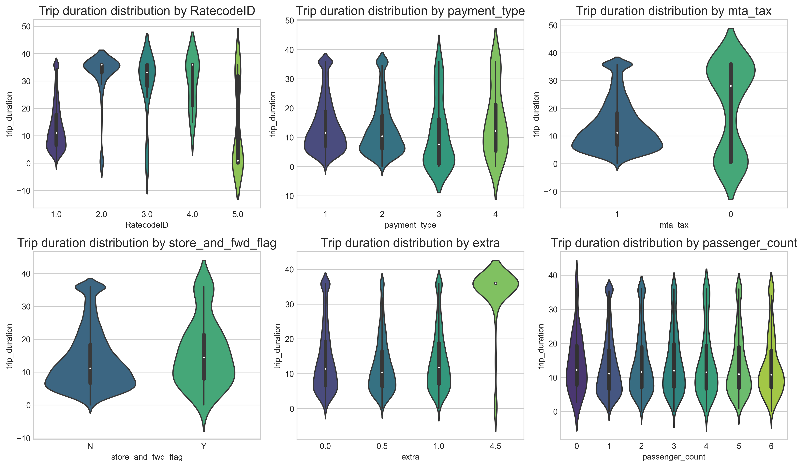

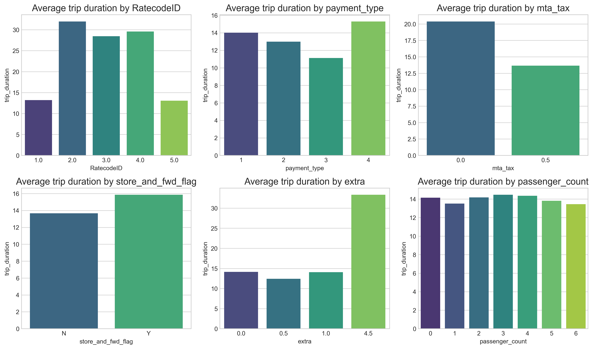

Based on groups' distribution and average `trip_duration` values in each categorical variables, the relationship between `store_and_fwd_flag`, `extra`, `passenger_count` and `trip_duration` is weak and not substantial. 

Some possible impactful variables could be included in the model based on the above analysis are: `mta_tax`, `RatecodeID`, `payment_type`

### 2. Checking for multicollinearity assumption

Relationship between continuous variables:

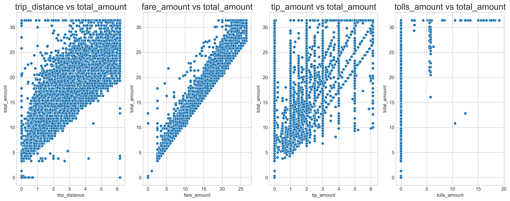

- It's clear that `fare_amount`, `trip_distance` have a strong relationship with `total_amount`, thus `trip_distance` and `fare_amount` can not be included in the model if `total_amount` is selected.

- While `tip_amount` have a moderate relationship with `total_amount`, that of `tolls_amount` is weak and unclear. Hypothesis testing would need to be conducted to further confirm `tolls_amount` and `total_amount` relationships are statistically significant and populationally presentative.

Based on above analysis, variables violate no-multicollinearity assumption (no two independent variables can be highly correlated with each other) are:

-  `trip_distance` have strong relationship with `total_amount` (correlation score = 0.92)

Continuous variables are selected for multi linear model are:

- `total_amount`
- `tip_amount`
- `tolls_amount`

### 3. Bulding Linear Regression Model using OLS Method

**What variables were selected and why?**

The variables were selected for modeling after considering 2 assumptions 
- Linearity: Each predictor (Xi) is linearly related to the outcome variable (Y)
- No multicollinearity: no two independent variables $(X_i, X_j)$ can be highly correlated with each other.
   - `mta_tax`
   - `RatecodeID`
   - `payment_type`
   - `total_amount`
   - `tip_amount`
   - `tolls_amount`
   
Other assumptions will be validated after the model is built:
- Normality : the errors/residuals ($y-\hat{y}$) are normally distributed
- Homoscedasticity : the variance of the error is constant or similar across the model.

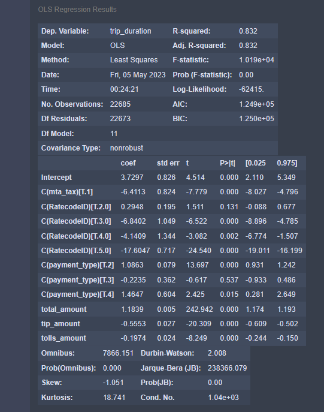

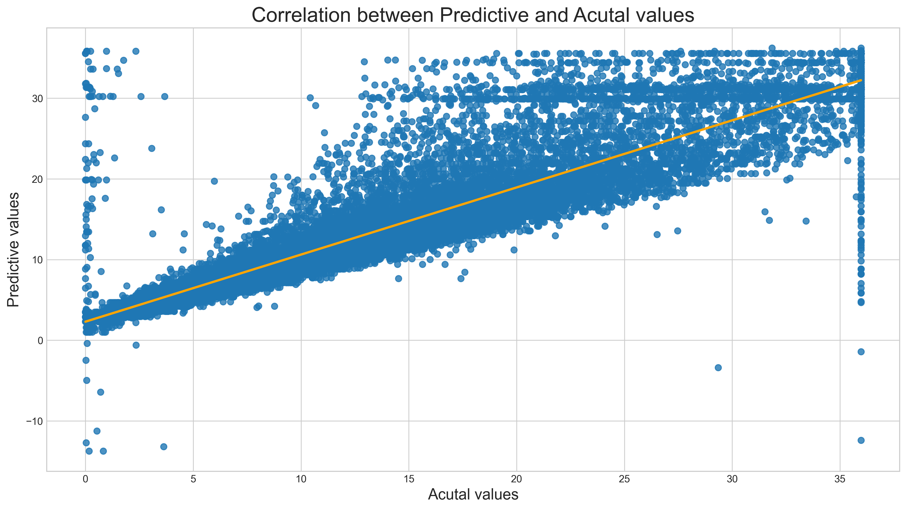

- R-squred = 0.83 is considerably high, which indicates that the model explains for about 83% of the variations of dependent variable, `trip_duration`
- RMSE (3.790) and MAE (2.398) are relatively low, which are acceptable levels of error.

**Question**: *What are the model coefficients?*
- $\beta_0 = 3.7297$
- $\beta_{(MTA-Tax = TRUE)} = -6.4113$
- $\beta_{(RateCodeID = 2)} = 0.2948$
- $\beta_{(RateCodeID = 3)} = -6.8402$
- $\beta_{(RateCodeID = 4)} = -4.1409$
- $\beta_{(RateCodeID = 5)} = -17.6047$
- $\beta_{(PaymentType = 2)} = 1.0863$
- $\beta_{(PaymentType = 3)} = -0.2235$
- $\beta_{(PaymentType = 4)} = 1.4647$
- $\beta_{(TotalAmount)} = 1.1839$
- $\beta_{(TipAmount)} = -0.5553$
- $\beta_{(TollsAmount)} = -0.1974$

**Question**: *What is your intepretation of the coefficient estimates? Are the coefficients statistically significant?*

- The P-value for all coefficients is less than 0.05, except for $\beta_{(RateCodeID = 2)} = 0.2948$ and $\beta_{(PaymentType = 3)} = -0.2235$. Those coefficients with P-value < 0.05 is statistically significant. 

- The 95% confidence intervals for each coefficient should be included when presenting results to stakeholders. For instance, there's 95% chance the interval $[2.110,  5.349]$ contains the true parameter of the model intercept.

### 4. Checking for Normality assumption

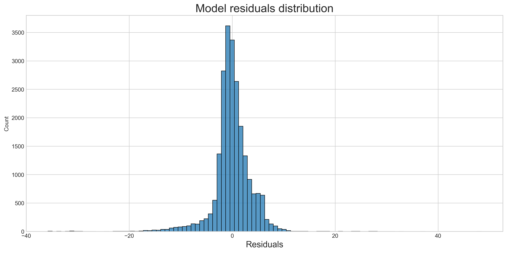

Since residuals fitted in normal distribution, the normality assumtion is met

### 5. Checking for Homoscedasticity assumption

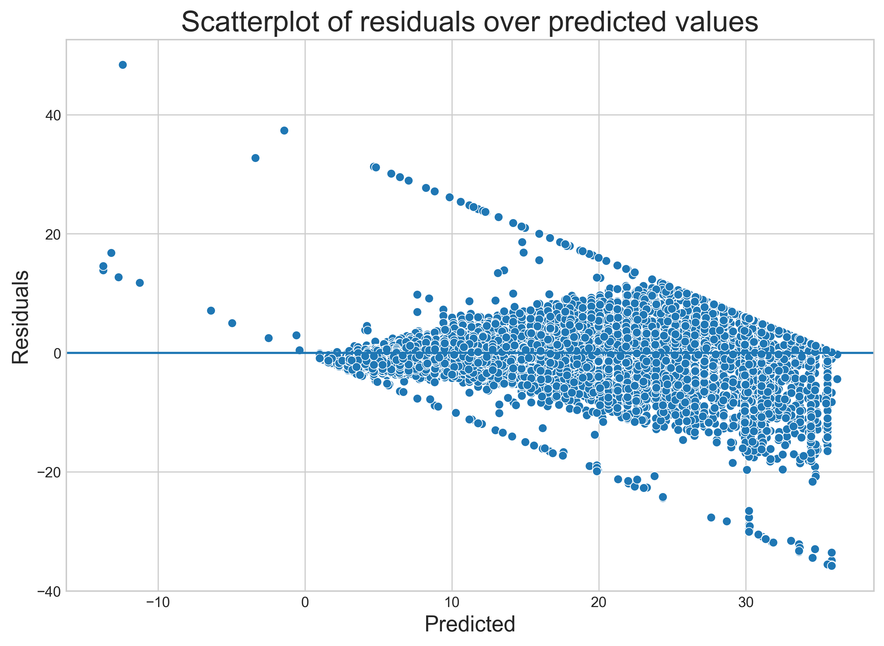

### 6. Assumption Conclusion

- **Linearity** : independent vairables selected for linear model is carefully accessed by correlated score and graphs which assures the predictors have good relationship with outcome variable.

- **Normality** : the model residuals are normally distributed indicating this assumption is met.

- **Independent Observations** : this assumption requires understanding of data sources and data collecting process. By default, there's not reason to beleive each trip (observation) in the data set is dependent to each other.

- **Homoscedasticity** : As being presented on the scatter plot between predicted values and residuals, the variance of error is nearly constant across fitted values.

### 7. ANOVA Analysis

Based on the OLS model summary, the 3 categorical variables `mta_tax`, `RatecodeID`, `payment_type` have $\beta$ coefficients with $P-value < 0.05$ which indicates the relationship of these variables with the outcome vairable `trip_duration` is statistically significant. But it can't be sure if there is a significant difference between the various groups in each categorical predictor. This is where ANOVA analysis comes in useful to explore further.

**The ANOVA analysis includes 4 steps:**

1. State the null and alternative hypothesis
2. Choose a significant level
3. Find the P-value 
4. Reject or fail to reject the null hypothesis
5. Perform post hoc test if the null hypothesis is rejected
---

One-way ANOVA  for "*RatecodeID*"

- $H_0 : \mu_{(1)} = \mu_{(2)} = \mu_{(3)} = \mu_{(4)} = \mu_{(5)} = \mu_{(6)}$

There is no difference in trip duration based on different RatecodeID

- $H_a$: Not $\mu_{(1)} = \mu_{(2)} = \mu_{(3)} = \mu_{(4)} = \mu_{(5)} = \mu_{(6)}$

There is a difference in trip duration based on different RatecodeID

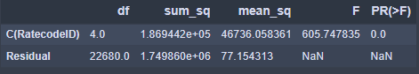

- PR(>F) = 0.0 indicates the P-value is smaller than 0.000000 which is less than 0.05. As the result, I reject $H_0$ and state that there is a significant difference in trip duration based on different RatecodeID.

- Post-hoc test would need performing to determine how one pair of groups different from each other.

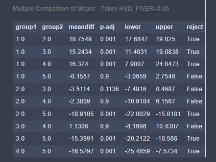

One-way ANOVA  for "*payment_type*"

- $H_0 : \mu_{(1)} = \mu_{(2)} = \mu_{(3)} = \mu_{(4)}$

There is no difference in trip duration based on different payment types

- $H_a$: Not $\mu_{(1)} = \mu_{(2)} = \mu_{(3)} = \mu_{(4)}$

There is a difference in trip duration based on different payment types

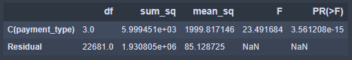

- The P-value `PR(>F)` is less than 0.05 => Reject $H_0$ and state that there is a significant difference in trip duration based on different payment types.

- Post-hoc test would need performing to determine how one pair of groups different from each other.

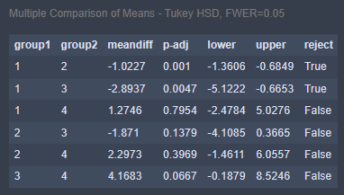

## V. Summary

The conclusion is performed by taking into consideration of OLS model, T-test, ANOVA, and Tukey's HSD results from the above analysis.

---
### Trip duration vs "*mta_tax*"
Given the name of the variable `C(mta_tax)[T.1]` in the OLS model result , we know that `C(mta_tax)[T.0]` is the reference point. The T-test result conveys that the average duration between trips being MTA tax charged and trips not being MTA tax charged is significantly different. This means that if all other variables are constant, then we would expect trips with `(mta_tax = 1)` to be $6.4113$ minutes less in duration compared to ones with `(mta_tax = 0)`. The 95% confidence intervals for the coefficient means there's 95% chance that the interval $[-8.027, -4.796]$ contains the true parameter of the slope of $\beta_{mta-tax}$.

### Trip duration vs "*RatecodeID*" and "*payment_type*"

Based on the result of OLS model, reference points for `RatecodeID` and `payment_type` are `(RatecodeID = 1.0)` and `(payment_type = 1)` respectively. 
- While the OLS model did not find statistical significance in the coefficient for `(RatecodeID = 2.0)`, with a p-value of 0.131, the results of the ANOVA and Tukey HSD tests conveys that there is a statistically significant difference between the mean values of group 1 `(RatecodeID 1.0)` and group 2 `(RatecodeID 2.0)`. The mean difference between the two groups is 18.75 with a p-value of 0.001, indicating that the difference is unlikely to have occurred by chance. 

- The same is true for `payment_type`. whereas the OLS result shows there's no statistical significance in the coefficient for `(payment_type = 3)`, with p-value of 0.537, ANOVA and Tukey HSD tests represents that there's a significant difference between the mean values of group 1 `(payment_type = 1)` and group 3 `(payment_type = 3)`. The mean difference between the two groups is 2.8937 with a p-value of 0.0047, indicating that the difference is unlikely to have occurred by chance. 

The difference between the two results could be due to the fact that the OLS model only takes into account the effect of each predictor variable on the response variable individually, without considering the effects of other variables. On the other hand, ANOVA and Tukey HSD tests are designed to compare the means of different groups, taking into account the effects of all variables in the model.

Therefore, It is important to consider the limitations of the method indicating that the differences between the groups in the two categorical variables `RatecodeID` and `payment_type` are more complex than a simple linear relationship captured by the OLS model.

### Trip duration vs "*total_amount*"

Based on OLS result, with the $P-value = 0.000$, which is less than 0.05, we can state that there's a relationship between `total_mount` and `trip_duration`, and the coefficient $\beta_{(TotalAmount)}$ is statistically significant. The model predicts that if other variables are constant, except $1$ dollar increase in `total_amount`, will result in $1.1839$ minute rise of trip duration. 95% confidence interval of the coefficient is $[1.174, 1.193]$

### Trip duration vs "*tip_amount*"

Similar to `total_amount`, the relationship of `trip_duration` and `tip_amount` is statistically significant with the $P-value = 0.000$. if other variables are constant, We would expect that with an increase by $1$ dollar in `tip_amount`, duration of trip will decrease by $0.5553$ minute. 95% confidence interval of the coefficient is $[-0.609, -0.502]$

### Trip duration vs "*tolls_amount*"

The OLS model suggests that the `tolls_amount` coefficient is statistically significant with $P-value =  0.000$. if we compare two trips which have the same characteristics, except one trip's tolls amount is 1 dollar greater, we would expect the trip with the greater tolls amount to have 0.1974 minute less duration than the trip with the less tolls amount. 95% confidence interval of the coefficient is $[-0.244, -0.150]$
